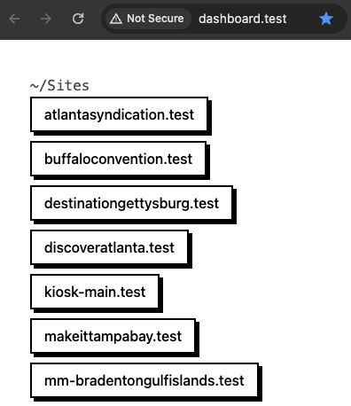

# Herd Dashboard

A simple dashboard for Laravel Herd to display all available sites.



A super minimal dashboard which lists each available site for all parked paths as well as Herd-linked sites.

## Installation

1. Clone or download the repo into a directory of your choosing  
E.g. `git clone https://github.com/aaemnnosttv/Herd-dashboard.git dashboard`
1. Move the new directory into a Herd-parked path or run `herd link` within it
1. Run `herd open` from within the directory!

## Configure as default site (optional)

If you would like to access your dashboard at http://localhost, simply define the path to your local Herd dashboard in as the `default` in your Herd config file.

> Newer installations of Herd put the `config.json` in `~/.config/Herd/` while older installations may use `~/.Herd/`

```diff
{
+   "default": "/absolute/path/to/herd-dashboard",
    "paths": [],
    "tld": "test"
}
```
